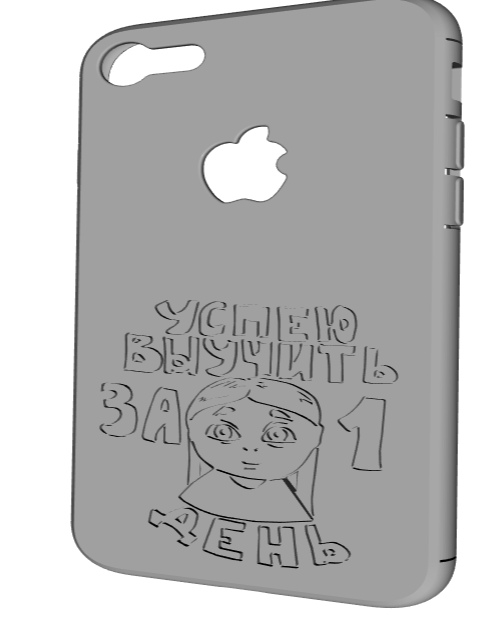

# Задание по Agile.
Объединиться в команды по 3-5 человек. \
Придумать продукт(не берите из прошлогодних инпраков, хочется чтобы вы сами проанализировали все документы).

Расписать для продукта начальный бэклог а именно:
- Функциональные требования (полностью)
- Нефункциональные требования (полностью)
- User Stories
- Use Cases

Можете каждый документ формировать коллективно, можете взять по одному.

### Описание проекта

**Идея**: Делать чехлы для смартфонов на 3D-принтере.

**Проблема**: Для конкретной модели телефона сложно подобрать чехол. На рынке представлены чехлы только для самых популярных моделей телефонов. Это оправдано, сложно оценить как реализуются чехлы для непопулярных смартфонов, а
чехол на айфон точно купят. И кроме того, моделей смартфонов очень много.

**Решение**: Печатать чехлы на 3D-принтере. Тогда чехол можно быстро изготовить под заказ, под любую модель смартфона. Кроме того, низкая себестоимость.

### Функциональные требования

ПО используется для упрощения создания готовой 3D-модели чехла. Затем, модель отправляется в печать. Оно должно представлять из себя набор Python/Bash скриптов, работающих под популярными Linux дистрибутивами.

К каждому скрипту должна прилагаться инструкция в виде: исполняемая задача; формат входных данных; формат выходных данных; набор пакетов ОС и Python-библиотек, необходимых для работы; указания по эксплуатации скрипа.

Скрипты, необходимые для решения задач Дизайнера:

1. Скрипт, преобразующий цветную векторную картинку формата .svg в несколько одноцветных .svg файлов. Необходмость вызвана тем, что 3D принтер в один момент времени может печатать лишь одним цветом. Это означает, что на каждый цвет нужна своя модель.

  Алгоритм работы скрипта: Векторная .svg картинка записывается в xml формате. Скрипт должен группировать теги с одинаковым значением атрибута "style" и записывать в новый файл. По одному файлу для каждого цвета.

  Пример разложения цветной картинки по отдельным цветам:

2. Скрипт, делающий плоскую векторную картинку объёмным объектом заданной глубины (формат .stl).

  Алгоритм работы: с помощью Linux-программ OpenSCAD и InkScape Bash-скрипт должен осуществлять следующие преобразования:

  svg → eps → openscad → stl

  Пример использования:

3. Скрипт, объединяющий модель чехла с объёмной картинкой, полученной скриптом №2.

  Алгоритм работы: с помощью Python библиотек выделить прямоугольник без отверстий на задней поверхности модели чехла. Отмасштабировать накладываемую картинку по размеру прямоугольника и вычесть картинку из чехла. Таким образом, в модели появляется выемка, которая впоследствии будет заполнена цветным пластиком.

  Пример использования:

### Нефункциональные требования

- Высокое качество печати (ровные рисунки, чехлы без заусенцев).

- Низкий процент брака (случаи, когда чехол трескается при надевании на телефон).

- Быстрый отклик на сообщения клиентов.

- Быстрое изготовление заказов.

- Еженедельная активность в сообществе ВК (посты, розыгрышы).

- Стабильное расширение ассортимента.

- Софт, работающий без ошибок для произвольных входных данных определённого формата.

- Высокое “автобусное число”, т.е. взаимозаменяемость членов команды.

- Соблюдение принципа “клиент всегда прав”. Возврат денег в случае неудовлетворительного качества или брака.

- Готовность к активному наплыву заказов. Возможности для масштабирования.

### User Stories

- Клиент заказал чехол с дизайном из Набора, stl-модель для которого уже существует в Базе.
- Клиент заказал чехол с дизайном из Набора, stl-модель для которого ещё не существует в Базе.
- Клиент заказал чехол с собственным дизайном, stl-модель для которого уже существует в Базе.
- Клиент заказал чехол с собственным дизайном, stl-модель для которого ещё не существует в Базе.

### Use cases

Все сценации начинаются одинаково:

1. Клиент заходит в Паблик.
2. Клиент выбирает дизайн из Набора или уже имеет собственный.
3. Клиент оформляет заказ. заполняя Форму.
4. Менеджер принимает заказ, оценивает сроки исполнения и договаривается о доставке.
5. Менеджер выделяет набор задач для Разработчика, Дизайнера, Рабочего и Курьера для исполнения полученного заказа.
6.
  - Сценарий 1 (дизайн из Набора, stl есть в Базе): \
    Дизайнер совмещает дизайн из Набора и stl из Базы с помощью Софта, написанного разработчиком.

  - Сценарий 2 (дизайн из Набора, stl нет в Базе): \
    Дизайнер ищет stl в Интернете. \
    Дизайнер совмещает дизайн из Набора и stl из Базы с помощью Софта.

  - Сценарий 3 (дизайн не из Набора, stl есть в Базе): \
    Дизайнер обрабатывает картинку, полученную от Клиента для совместимости с форматом, который  Софт требует на вход. \
    Дизайнер совмещает дизайн из Набора и stl из Базы с помощью Софта.

  - Сценарий 4 (дизайн не из Набора, stl нет в Базе): \
    Дизайнер ищет stl в Интернете. \
    Дизайнер обрабатывает картинку, полученную от Клиента для совместимости с форматом, который  Софт требует на вход. \
    Дизайнер совмещает дизайн из Набора и stl из Базы с помощью Софта.

Сценарии заканчиваются одинаково:

7. Рабочий преобразует .stl модель, полученную от Дизайнера в команды для 3D принтера.

8. Рабочий печатает модель на 3D принтере.

9. Рабочий упаковывает товар для доставки.

10. Курьер доставляет товар и принимает оплату.

В сценариях может возникнуть ряд исключительных ситуаций:

- В процессе эксплуатации находятся ошибки в работе Софта. В этом случае Разработчик получает ASAP задачу на исправление ошибок.

- Дизайнер не может найти .stl модель для указанного телефона в Интернете. В таком случае Менеджер приносит извинения Клиенту и отменяет Заказ.

- У Рабочего заканчиваются материалы для печати/происходит поломка. В этом случае свободный член команды осуществляет докупку необходимых материалов/запчастей.

- Во время получения товара обнаруживается брак или Клиента не устраивает качество. В таком случае Клиенту либо возвращаются деньги, либо Заказ переделывается по желанию Клиента.

- Если Клиент обнаруживает брак в первую неделю после покупки, Клиенту по его желанию либо возвращаются деньги, либо Заказ переделывается.
